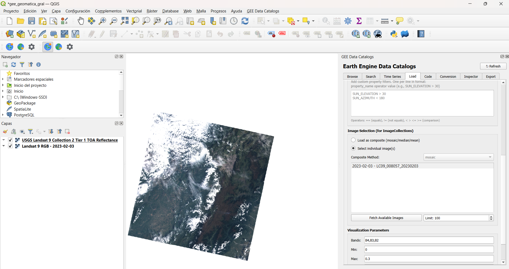
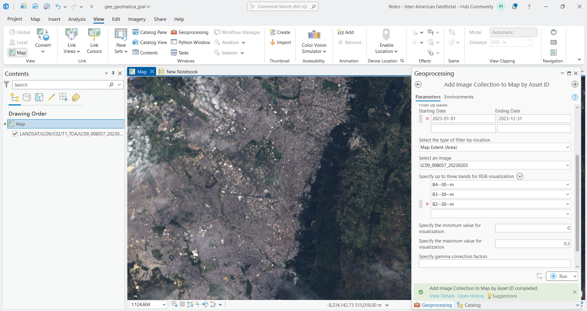
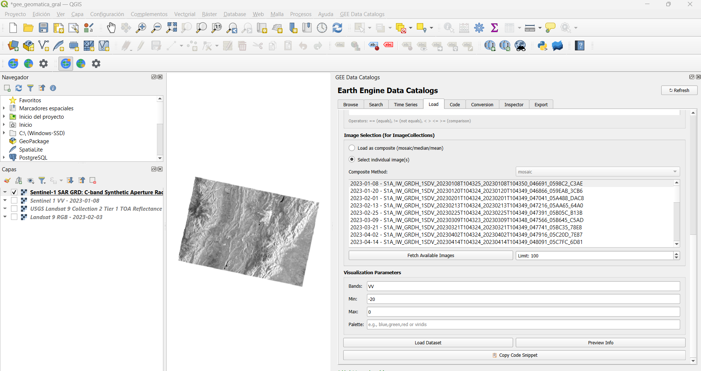
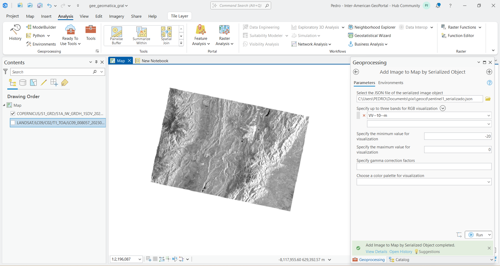
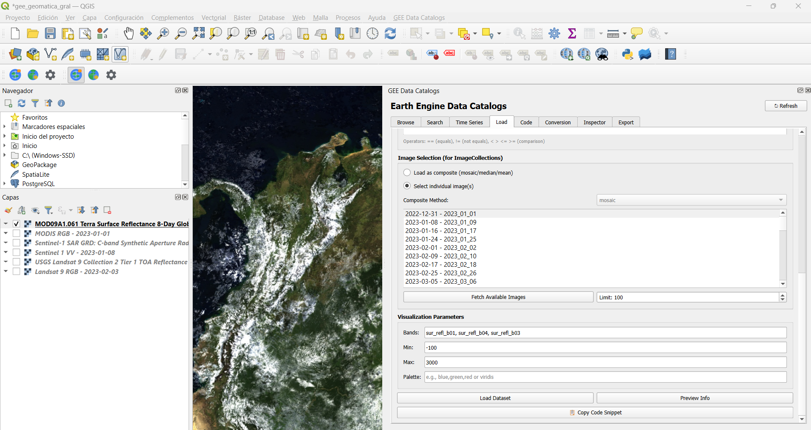
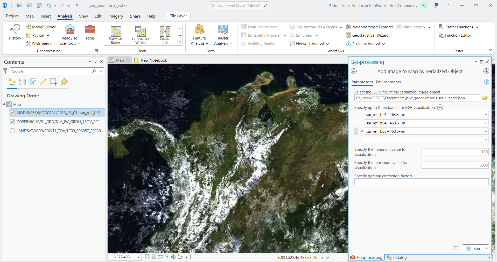
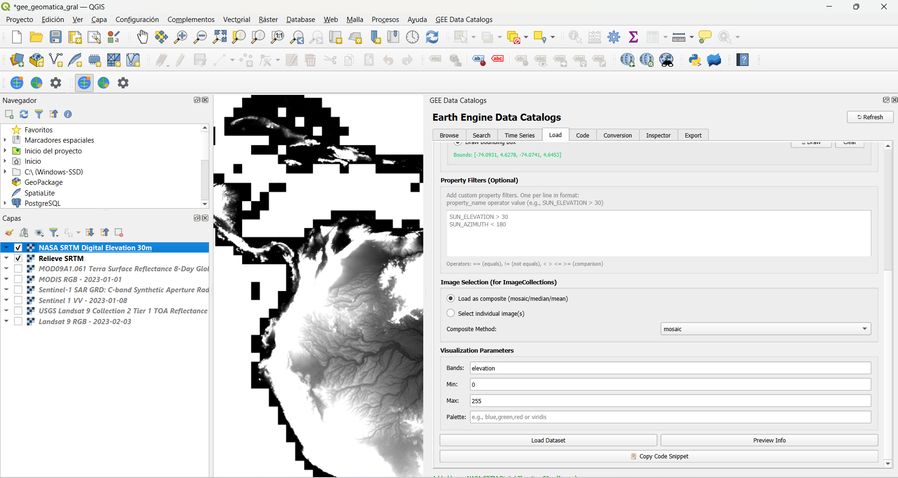
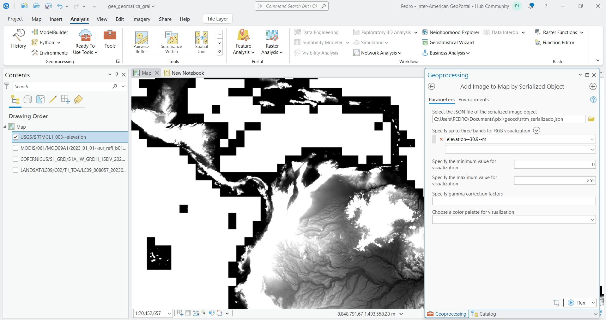
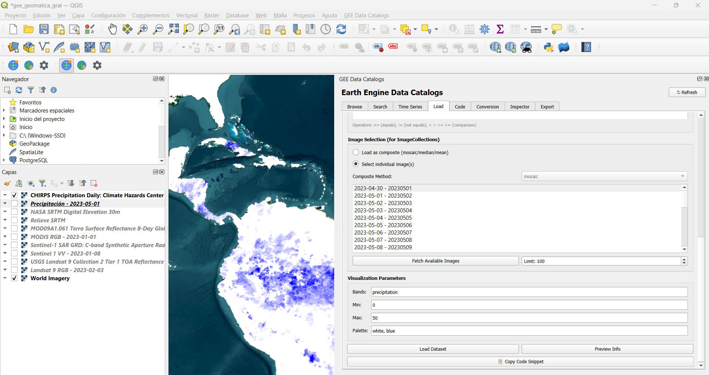
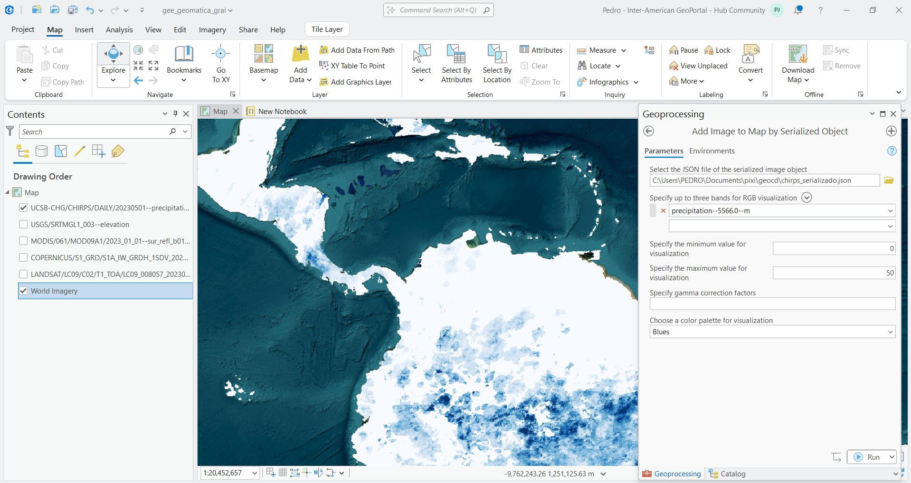

# Contexto General

El procesamiento de imágenes satelitales y el análisis de variables biofísicas requieren una alta capacidad de cómputo. El uso de **Google Earth Engine (GEE)** permite analizar petabytes de datos espaciales alojados en la nube sin depender de hardware local, democratizando el análisis a escala planetaria [@gorelick2017]. Esto es fundamental para el análisis multitemporal de coberturas, la evaluación del terreno y la exploración de sitios a escala regional.

En esta práctica se integran los flujos de trabajo en la nube mediante secuencias de comandos (Python/JavaScript) con los Sistemas de Información Geográfica (SIG) de escritorio tradicionales, como **QGIS** [@wu2025] y **ArcGIS Pro** [@price2020; @tanh2025].

::: {.callout-tip}
La interoperabilidad mediante *Asset IDs* y objetos serializados (JSON) permite aprovechar la potencia del servidor de Google manteniendo las capacidades cartográficas de nuestro software local.
:::

---

# Parte 1: Ficha técnica de insumos

A continuación se consolidan las fuentes de datos espaciales utilizadas. Los parámetros físicos se resumen en la tabla, mientras que los identificadores de catálogo (Asset IDs) y descripciones detalladas de los productos derivados se encuentran en la lista posterior.

## Parámetros Técnicos Generales

| Conjunto de Datos | Satélite / Sensor | Res. Espacial | Frecuencia | Bandas Principales |
|:---|:---|:---|:---|:---|
| **Landsat 9** | Landsat 9 | 30 m | ~16 días | B2, B3, B4, B5. (Reflectancia 0 a 1) |
| **Sentinel-2** | Sentinel-2 | 10 m | ~5 días | B2, B3, B4, B8. (Reflectancia 0 a 10000) |
| **Sentinel-1** | Radar C-band | 10 m | ~6 a 12 días | VV, VH. (Retrodispersión en dB) |
| **MODIS** | Terra / Aqua | 500 m | 8 días | sur_refl_b01 al b04. (-100 a 3000) |
| **SRTM** | Misión SRTM | 30 m | Estática | elevation. (Metros de altitud) |
| **CHIRPS** | IR + Estaciones | ~5.5 km | Diaria | precipitation. (mm/día) |
| **Open Buildings** | Google (IA) | Vectorial | Periódica | footprint. (Polígonos espaciales) |
| **BlackMarble** | Suomi NPP (VIIRS) | 500 m | Mensual | avg_rad. (0 a 60) |
| **DSWx Agua** | Sentinel-1 (OPERA) | 30 m | Frecuente | WTR_Water_classification. (0 a 4) |
| **WorldPop** | Censos + IA | 100 m | Anual | population. (Habitantes por píxel) |

## Identificadores y Productos Derivados

A continuación se detallan los Asset IDs exactos utilizados en Google Earth Engine y la descripción de los productos que son modelados o derivados:

### Identificadores de conjuntos de datos crudos:
* **Landsat 9 Crudo:** `LANDSAT/LC09/C02/T1_TOA`
* **Sentinel-2 Crudo:** `COPERNICUS/S2_SR_HARMONIZED`
* **Sentinel-1 SAR:** `COPERNICUS/S1_GRD`
* **MODIS:** `MODIS/061/MOD09A1`

### **Productos derivados:**
* **Topografía (SRTM):** `USGS/SRTMGL1_003`. Modelo Digital de Elevación (DEM) global construido mediante interferometría de radar en el año 2000. El valor numérico del píxel indica la altitud en metros sobre el nivel medio del mar.
* **Clima (CHIRPS):** `UCSB-CHG/CHIRPS/DAILY`. Conjunto de datos de lluvia diaria. Combina observaciones satelitales infrarrojas con registros de estaciones terrestres. El valor del píxel representa la precipitación en milímetros por día (mm/día).
* **Cuerpos de Agua (DSWx):** `OPERA/DSWX/L3_V1/S1`. Mapa de detección de agua superficial usando radar, lo que evita la interferencia de nubes. El píxel usa valores categóricos: `0` (No agua), `1` (Agua abierta), `2` (Agua parcial), `3` (Nieve/Hielo) y `4` (Sombra/Nubes).
* **Densidad Poblacional (WorldPop):** `WorldPop/GP/100m/pop`. Estimación de distribución humana. Distribuye datos de censos oficiales mediante Machine Learning usando covariables espaciales. El píxel indica la cantidad estimada de habitantes en áreas de 100x100m.
* **Huellas de Edificios (Open Buildings):** `GOOGLE/Research/open-buildings/v3/polygons`. Base de datos vectorial extraída por Inteligencia Artificial a partir de imágenes de muy alta resolución. Contiene los polígonos geométricos de las construcciones.
* **Luces Nocturnas (BlackMarble):** `NOAA/VIIRS/DNB/MONTHLY_V1/VCMSLCFG`. Emisión lumínica nocturna capturada por el sensor VIIRS, útil para detectar áreas urbanas.
---

# Parte 2: Diccionario de funciones GEE

El ecosistema de Earth Engine se basa en una sintaxis específica para manipular datos geoespaciales a nivel de servidor.

- **`ee.Geometry.Point()` y `ee.FeatureCollection()`:** El primero define una coordenada matemática exacta plana (longitud, latitud) en el servidor. El segundo agrupa múltiples geometrías vectoriales (polígonos, líneas, puntos) junto con sus tablas de atributos.
- **`ee.ImageCollection()` y `ee.Image()`:** `ImageCollection` invoca el catálogo histórico completo de un sensor o proyecto. `Image` aísla y representa un único archivo raster con sus respectivas bandas espectrales.
- **Filtros (`.filterBounds()`, `.filterDate()`, `.filter(ee.Filter...)`):** Operaciones lógicas para reducir drásticamente el volumen de datos a procesar, seleccionando únicamente las imágenes que intersectan un área de estudio, un periodo de tiempo o cumplen un parámetro de calidad (ej. nubosidad menor al 10%).
- **Geoprocesos (`.clip()`, `.normalizedDifference()`):** `.clip()` enmascara espacialmente un raster utilizando un polígono como límite. `.normalizedDifference()` computa algebraicamente el índice normalizado entre dos bandas dadas.
- **Comunicación cliente-servidor (`.getInfo()`, `.serialize()`):** `.getInfo()` ordena al servidor ejecutar el grafo computacional y retornar el valor final a la memoria local. `.serialize()` traduce las instrucciones algorítmicas de Python a un formato JSON ligero comprensible por los servidores de Google.
- **Estadísticas (`.reduceRegion()`):** Aplica reductores espaciales (como promedios, máximos o mínimos) sobre todos los píxeles de una imagen que caen dentro de una geometría específica.

---

# Parte 3: Evidencias de integración GIS

Las siguientes capturas demuestran la importación de datos satelitales crudos y procesados directamente en el entorno de escritorio, puenteando la interfaz visual de los SIG locales con el procesamiento en la nube.

## Reporte visual de Landsat 9
Se visualiza la colección de reflectancia de la misión Landsat 9 (NASA/USGS). Este sensor óptico proporciona imágenes multiespectrales con una resolución de 30 metros, permitiendo identificar coberturas vegetales y usos del suelo mediante la combinación de bandas visibles e infrarrojas de onda corta.

Captura de QGIS (Pestaña Load):  
{fig-align="center" width="70%"}

Captura de ArcGIS Pro (Herramienta utilizada):  
{fig-align="center" width="70%"}



## Reporte visual de Sentinel 1 (SAR)
Se presenta el procesamiento de datos del sensor de radar de apertura sintética (SAR) de la misión Sentinel-1 (ESA). Al operar en la banda C, este sensor permite la observación de la superficie terrestre a través de nubes y en condiciones de oscuridad, siendo fundamental para detectar cambios en la textura del terreno y cuerpos de agua.

Captura de QGIS (Pestaña Load):  
{fig-align="center" width="70%"}

Captura de ArcGIS Pro (Herramienta utilizada):  
{fig-align="center" width="70%"}



## Reporte visual de MODIS
Se muestra un producto de reflectancia de superficie capturado por el sensor MODIS a bordo de los satélites Terra y Aqua. Aunque su resolución es de 500 metros, su alta frecuencia de captura (cada 8 días) lo hace ideal para el monitoreo dinámico de variables biofísicas y cambios fenológicos a escala regional.

Captura de QGIS (Pestaña Load):  
{fig-align="center" width="70%"}

Captura de ArcGIS Pro (Herramienta utilizada):  
{fig-align="center" width="70%"}



## Reporte visual de Topografía SRTM
Se ilustra el Modelo Digital de Elevación (DEM) derivado de la misión Shuttle Radar Topography Mission (SRTM). Este insumo proporciona datos globales sobre la altitud del terreno con una resolución de 30 metros, permitiendo realizar análisis de pendientes, cuencas hidrológicas y modelado del relieve.

Captura de QGIS (Pestaña Load):  
{fig-align="center" width="70%"}

Captura de ArcGIS Pro (Herramienta utilizada):  
{fig-align="center" width="70%"}



## Reporte visual de CHIRPS (Precipitación)
El mapa representa los datos de precipitación diaria provenientes de la serie CHIRPS. Esta fuente integra datos satelitales infrarrojos con registros de estaciones meteorológicas terrestres para crear grillas de lluvia precisas, esenciales para el monitoreo de sequías y la gestión de recursos hídricos.

Captura de QGIS (Pestaña Load):  
{fig-align="center" width="70%"}

Captura de ArcGIS Pro (Herramienta utilizada):  
{fig-align="center" width="70%"}

---

# Parte 4: Análisis Teórico

## Sobre la arquitectura cliente-servidor
Al ejecutar un filtro complejo en GEE sobre miles de imágenes Sentinel-2, la computadora local no se satura debido a la delegación de procesos. El entorno local (el *Cliente*) únicamente construye un grafo computacional de instrucciones. A través de la función `.serialize()`, estas instrucciones se empaquetan en un archivo de texto ligero (JSON) que viaja por internet hacia los centros de datos de Google (el *Servidor*). Es allí, apoyado en el paralelismo de la nube, donde se realiza la búsqueda y el cálculo matricial. El servidor solo devuelve el producto final renderizado o el resultado estadístico.

::: {.callout-note}
El cliente dicta *qué* hacer, pero el servidor decide *cómo* distribuir los recursos de hardware para lograrlo.
:::

## Sobre sensores crudos vs. productos derivados
La colección `COPERNICUS/S2_SR_HARMONIZED` es un registro físico directo: el sensor midió la cantidad real de energía electromagnética reflejada por la superficie terrestre en diferentes longitudes de onda. Por el contrario, un producto como `WorldPop/GP/100m/pop` es un dato modelado sintéticamente. Ningún satélite capta la "cantidad de personas"; este producto se genera a partir de censos oficiales que luego son espacializados usando algoritmos de *Machine Learning* apoyados en variables proxy (luces nocturnas, cercanía a vías, topografía).

## Sobre el álgebra de mapas y la física del NDVI

El Índice de Vegetación de Diferencia Normalizada (NDVI) es una operación de álgebra de mapas que explota la **firma espectral** de las diferentes coberturas terrestres. Su fundamento radica en cómo interactúan los fotones de luz con la superficie, evaluado a través de la siguiente relación matemática:

$$NDVI = \frac{NIR - Rojo}{NIR + Rojo}$$

Esta ecuación matemática normalizada arroja valores que oscilan estrictamente entre -1 y 1. Su comportamiento físico se explica de la siguiente manera:

* **Vegetación fotosintéticamente activa (Ej. Parque El Salitre):** Los pigmentos de las hojas (clorofila) absorben masivamente la luz visible, especialmente en la banda del **Rojo**, para realizar la fotosíntesis. Simultáneamente, la estructura celular interna (el mesófilo esponjoso) refleja fuertemente la luz **Infrarroja Cercana (NIR)** para evitar el sobrecalentamiento de la planta. Al tener un $NIR$ muy alto y un $Rojo$ muy bajo, el numerador de la ecuación se maximiza, arrojando valores fuertemente positivos (usualmente entre **0.6 y 0.9**).
* **Áreas urbanas (concreto, asfalto y suelo desnudo):** Los materiales de construcción y los suelos secos o estériles presentan una reflectancia muy similar tanto en la banda del Rojo como en el NIR. Al ser valores casi idénticos ($NIR \approx Rojo$), la resta en el numerador tiende a cero, resultando en un índice con valores cercanos a **0**.
* **Cuerpos de agua y sombras profundas:** El agua pura es un absorbente casi perfecto de la radiación infrarroja, pero refleja una ligera porción de la luz visible. En este escenario físico, la reflectancia del Rojo supera a la del Infrarrojo Cercano ($NIR < Rojo$), haciendo que la resta en el numerador sea negativa y, en consecuencia, el índice arroje valores **menores a 0**.

# Referencias Bibliográficas 

::: {#refs}
:::
